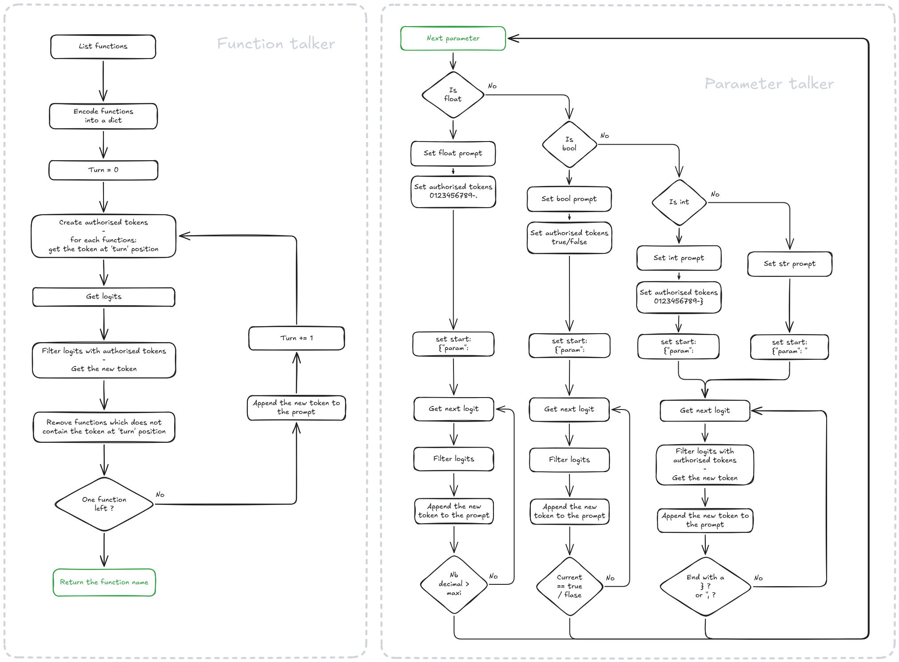

# 42_call_me_maybe
Does LLMs speak the language of computers? We’ll find out.

- Parameter: Variable in the prototype
- Argument: Value of a parameter

### Description

The purpose is to discover the [Function Calling System](https://developers.openai.com/api/docs/guides/function-calling).  

Given:
- A list of functions
- A plain text sentence

Ask a small LLM model to select the correct function and extract all arguments in JSON format.  

```json
User: "What is the sum of 40 and 2?"
Function Calling System:
{
"function": "add_numbers",
"arguments": {"a": 40, "b": 2}
}
```

### Example usage

### Instructions
This project uses [UV](https://docs.astral.sh/uv/) for automatic virtual environment management.  
Once installed, you can use it with the Makefile with these commands:

```Bash
    make install
    make clean
    make lint
```
```Bash
  uv run python -m src [--functions_definition <function_definition_file>] \
                       [--input <input_file>] \
                       [--output <output_file>] \
                       [--model <[deepseek|lama|qwen]>]
```
Usage:
```Bash
    uv run python -m src
```
The project contains a folder named [data]() with some examples:  
```Bash
    make examples
```

### Resources
[Function Calling System](https://developers.openai.com/api/docs/guides/function-calling)  
[Qwen/Qwen3-0.6B](https://github.com/QwenLM/Qwen3)  
[Hugging Face](https://huggingface.co/)  
[Textual](https://textual.textualize.io/)  
[UV](https://docs.astral.sh/uv/)  

### Design decisions
I choose to split tasks to use several prompts and constraints.  

So for each prompt, the logic is:
- Find the [function's name](https://github.com/flinguenheld/42_call_me_maybe/blob/master/src/talker/function/function.py)
- Find each [function's parameters](https://github.com/flinguenheld/42_call_me_maybe/blob/master/src/talker/parameter/parameter.py) in a unique JSON:
    - Set the [prompt](https://github.com/flinguenheld/42_call_me_maybe/blob/master/src/talker/parameter/parameter.py#L22) according to [the type](https://github.com/flinguenheld/42_call_me_maybe/blob/master/src/talker/talker_manager.py#L86)
    - Set the list of [authorised tokens](https://github.com/flinguenheld/42_call_me_maybe/blob/master/src/talker/parameter/parameter_float.py#L41)
    - Set the [start of the JSON](https://github.com/flinguenheld/42_call_me_maybe/blob/master/src/talker/parameter/parameter_int.py#L38) answer
    - Get the tokens until the [end of the JSON](https://github.com/flinguenheld/42_call_me_maybe/blob/master/src/talker/parameter/parameter.py#L91)
- [Merge the JSON](https://github.com/flinguenheld/42_call_me_maybe/blob/master/src/utils/files.py#L41) to update the ouput

### Algorithm explanation

<div align="center">
    
</div>


### Performance analysis

To make the process faster, I choose to:
- Have very short prompts
- One prompt per type
- Fill the prompt with already known parts such as parameter names

Thanks to that, the generation is pretty fast for each prompt.

### Challenges faced

The main challenge was to understand how the LLM works like the logits.  
And the way it sets them is very obscure.  
Due to that, writing prompts looks magic and it's complicated to find one which works for each cases.

### Testing strategy

I wrote a visual representation to see what's happening.  
A serie of [pytests](https://docs.pytest.org/en/stable/) would be the best choice to update prompts.  
